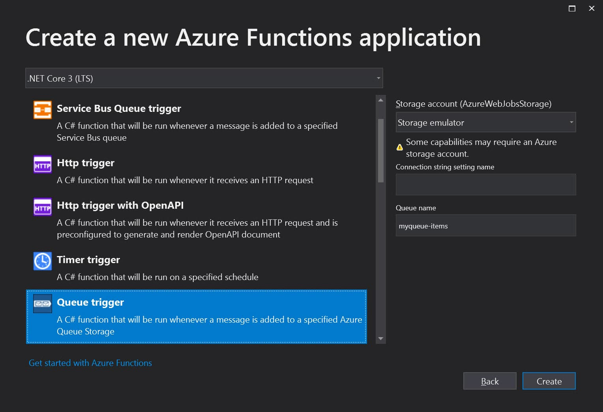
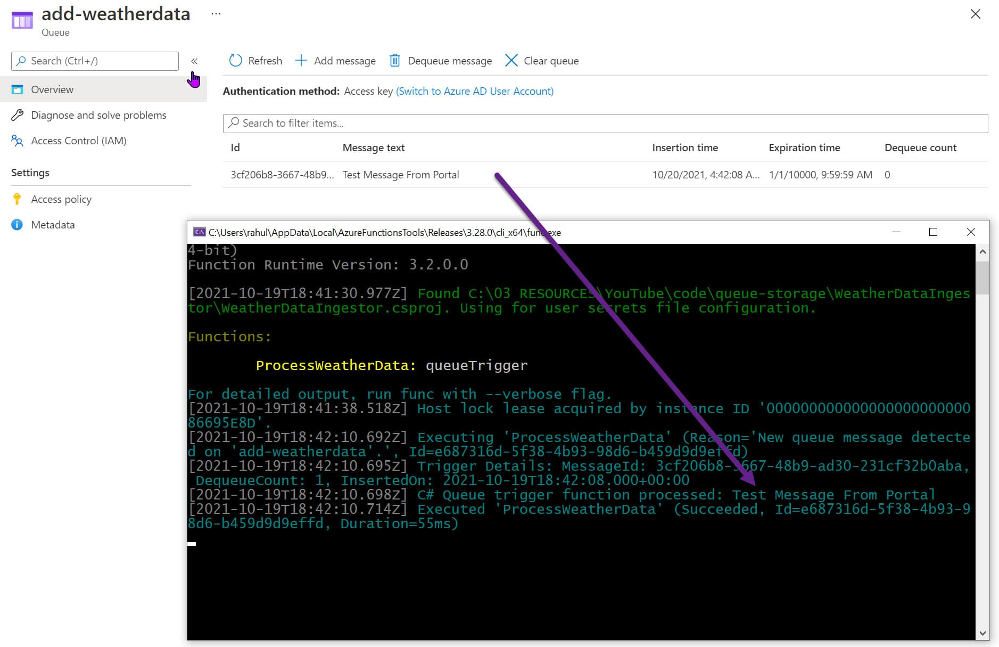
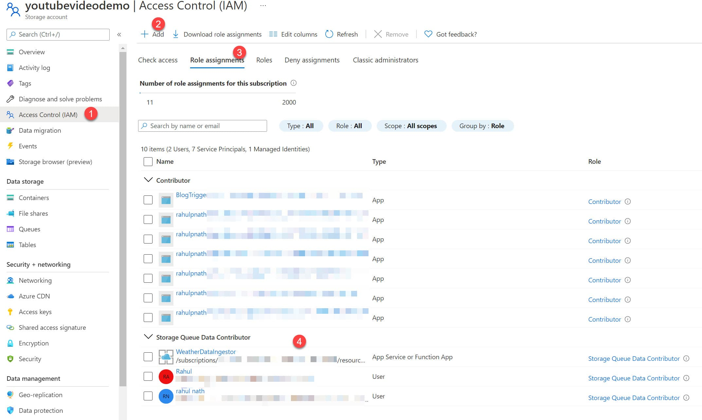
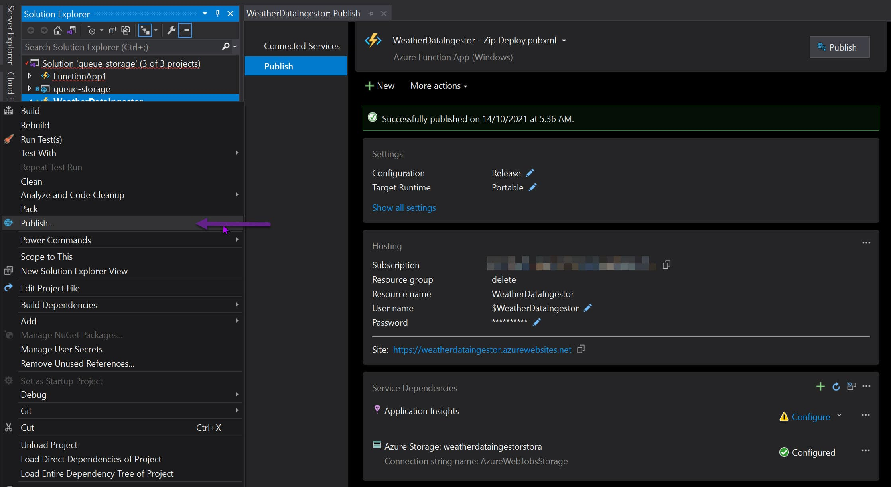

import { Bookmark } from 'components/common'

What is the most essential part of programming?

Yes, you guessed it correct - ***The code!*** 

Azure Functions provides serverless compute for Azure. It allows us to focus on code pieces that matter most and let Azure handle the infrastructure and other aspects of running the code. It means we as programmers have fewer things to maintain and manage, which often means less cost.

In this blog post, let’s write our first Azure Function and learn the main concepts. We will write an Azure Function to process messages coming to an Azure Storage Queue automatically. 

Azure Functions can be used to build web APIs, respond to database changes, process streams, manage message queues, and much more.

If you prefer to watch along while you read, check out my video here 👇

`youtube:https://www.youtube.com/embed/27OUTVdK2_0`


## Writing Our First Function

Before proceeding any further, make sure you have the [Azure Functions Core Tools](https://docs.microsoft.com/en-us/azure/azure-functions/functions-run-local?WT.mc_id=AZ-MVP-5003875) installed. 

Azure Functions Core Tools help develop and test functions on the local computer using the full Functions runtime. Depending on the IDE that you use to write code, you can pick and choose different ways to create a Function - [Command line](https://docs.microsoft.com/en-us/azure/azure-functions/create-first-function-cli-csharp?WT.mc_id=AZ-MVP-5003875), [VS Code](https://docs.microsoft.com/en-us/azure/azure-functions/create-first-function-vs-code-csharp?WT.mc_id=AZ-MVP-5003875), [Visual Studio](https://docs.microsoft.com/en-us/azure/azure-functions/functions-create-your-first-function-visual-studio?WT.mc_id=AZ-MVP-5003875), [Rider](https://blog.jetbrains.com/dotnet/2019/05/09/building-azure-functions-sql-database-improvements-azure-toolkit-rider-2019-1/) etc.

Creating a Functions involves choosing a template for the Function Trigger.



When creating an Azure Function, we need to specify a Storage Account (*`AzureWebJobsStorage`*). In the above example, it is set to the Storage Emulator. When we deploy the Function to the Azure infrastructure, this needs to be a real Azure Storage Account that supports Blob, Queue, and Table storage. 

This storage account manages triggers, logging function executions, and other meta information of the Azure Function itself. [Here are a few considerations](https://docs.microsoft.com/en-us/azure/azure-functions/storage-considerations?WT.mc_id=AZ-MVP-5003875) you need to make if you are reusing an existing storage account for running a Function.

The `AzureWebJobsStorage` Storage Account is not related to the account that the Function is listening for queue messages. That Queue/Storage is identified by the two values below the `AzureWebJobsStorage` setting in the above dialog/diagram.

### Triggers

Triggers run Azure Functions. 

It defines how/when a Function is invoked. Every Function must have exactly one trigger. Depending on the trigger, it has associated data that is passed on the Azure Function as payload. 

In this example, we want to process messages coming into Azure Queue Storage. The Queue trigger template helps set up the initial code required for this.

### Function Code

An Azure Function is defined as a static method within a class library project identified by the `FunctionName` attribute. This method is the Function’s entry point. The method must define a Trigger attribute that specifies the trigger type and binds input data. 

The below function is an Azure Queue Storage triggered Function. It runs anytime a message is dropped in the `add-weatherdata`. The connection string to the queue is specified as part of the environment configuration with the name `WeatherDataQueue`.

“`csharp
public static class Function1
{
    [FunctionName("ProcessWeatherData")]
    public static void Run(
        [QueueTrigger("add-weatherdata", Connection = "WeatherDataQueue")]string myQueueItem, 
        ILogger log)
    {
        log.LogInformation($"C# Queue trigger function processed: {myQueueItem}");
    }
}
```

The connection string `WeatherDataQueue` can be specified as part of the `local.settings.json` file when running on the local development computer. 

“`csharp
{
  "IsEncrypted": false,
  "Values": {
    "AzureWebJobsStorage": "UseDevelopmentStorage=true",
    "FUNCTIONS_WORKER_RUNTIME": "dotnet",
    "WeatherDataQueue": "<Connection String to Azure Storage Account>"
  }
}
```

Run the application after setting the correct connection string. If you drop messages to the queue either via the Azure Portal or using code, it will automatically be picked up the Function code and process. 

In this case, it simply logs the message.



## Azure Function & Managed Identity

Azure Functions supports Managed Identities. 

This means we can avoid having to put in connection strings to connect to other resources (that support Managed Identities) and instead let Azure manage the credentials for us. 

<Bookmark
  slug="defaultazurecredential-from-azure-sdk"
  title= “Want To Learn More About DefaultAzureCredential?”
  description= “In the past, Azure had different ways to authenticate with the various resources. The Azure SDK’s is bringing this all under one roof and providing a more unified approach to developers when connecting to resources on Azure.”
/>

In our example, we added in the `WeatherDataQueue` connection string to connect to the Azure Queue Storage. We can replace this to use Managed Identites.

To enable Managed Identities for QueueTrigger we need to update it to the latest Nuget package ([Extension version 5.0.0-beta1 or later](https://docs.microsoft.com/en-us/azure/azure-functions/functions-bindings-storage-queue?WT.mc_id=AZ-MVP-5003875#storage-extension-5x-and-higher)). 

With the updated packages, update the connection string name in `local.settings.json` file with a suffix `__queueServiceUri`.

“`csharp
{
  "IsEncrypted": false,
  "Values": {
    "AzureWebJobsStorage": "UseDevelopmentStorage=true",
    "FUNCTIONS_WORKER_RUNTIME": "dotnet",
    "WeatherDataQueue__queueServiceUri": "https://youtubevideodemo.queue.core.windows.net/"
  }
}
```

The `QueueTrigger` class is set up to use Managed Identity to connect to the Storage Account when it detects a connection string value appended with the *serviceUri*.

Make sure to grant the Identity the application is running under appropriate permissions in the Azure Storage Account.

When running on the local machine, it can automatically pick up the user logged in to Visual Studio. If the Function is running in Azure infrastructure, enable Identity on the resource and grant it permissions. 



Since we need to access Queue Storage to read, write, and delete messages, I have assigned the ‘*Storage Queue Data Contributor*’ role for the appropriate identities as shown above.

The application does not use any secrets or sensitive information to connect the Queue Storage. The Azure infrastructure is automatically managing this for us. It is one less thing to worry about for us developers. 

## Deploying Azure Functions

The easiest way to deploy (for testing purposes) is to Publish from the IDE. In Visual Studio, this is built-in, for other IDE’s you will have to install the Azure Tools Extension.



For real-world applications, I suggest setting up a build-deploy pipeline. If you are using Azure DevOps, check out the below video 👇

`youtube:https://www.youtube.com/embed/_cOckpopDkY`

We have successfully created an Azure Function, set it up to process messages from a Queue Storage, and have an end-to-end build and deploy pipeline to push our code into the Azure Infrastructure. 

Any time we change our Function and commit it to our git repository, it will be automatically deployed to the corresponding environment. 

I hope this helped you to understand and write your first Azure Function ⚡