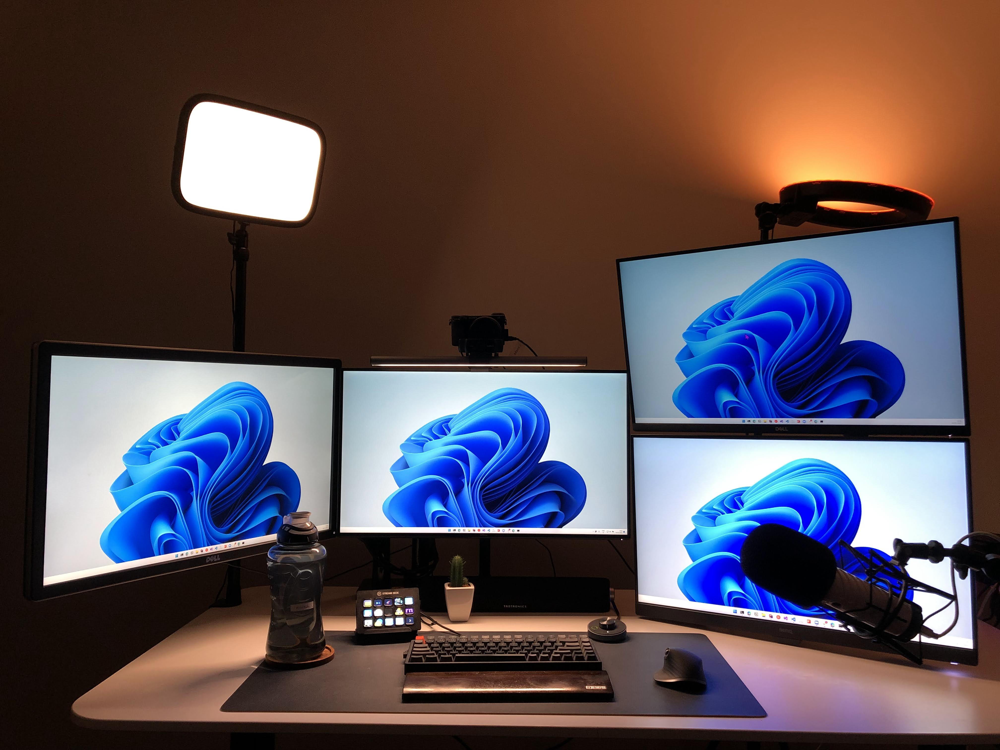
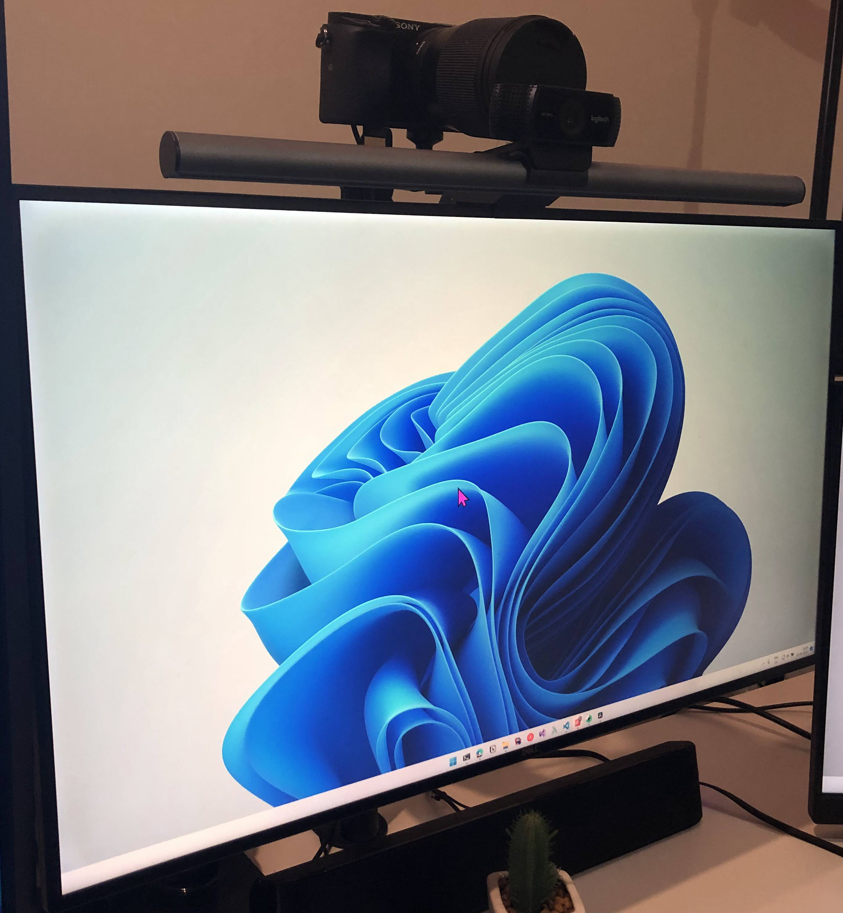

I get asked a lot about the tools - both software and hardware - that I use for different parts of my work. 

This ***Uses*** page covers all the tools that I use personally and professionally.

I will keep this up to date, so most probably, what’s listed here is what I am using currently.

I’ve been slowly building up my desk setup over the years. Some of the items, even though costly, pay off a lot considering their lifetime and usefulness. 

## Workstation

- [**Laptop - Metabox Prime-X**](https://www.metabox.com.au/store/Prime-X-Range)    
My current laptop is a Metabox Prime-X (X170KM-G) and is a work (Oztix) allowance. Before, I was using a Lenovo X1 Carbon Extreme Gen 2 and a Surface Pro 5 (both under Readify/Telstra Purple device allowance).   
I’ve been fortunate to work for employers with a generous device allowance policy, which makes getting such high-end machines possible. The laptop sits on top of the [TopMate C12 Laptop](https://www.amazon.com.au/TopMate-Notebook-Adjustable-15-6-17-3-Laptops-Ice/dp/B09QPP3CDL) **cooling pad**.

- **Monitors**   
I started with no monitors initially. I was always comfortable working off a single screen (still can/do if needed). However, additional screens have their benefits. I am unsure whether there is a sweet spot of productivity to the number of monitors, but I think I have too many now. I had two until last year and recently added a third one. But the loving folks at BenQ Australia recently sent me the 4th one, and I happily added that to my setup. I love the Eye-care features of the BenQ monitor, especially the [coding and reading modes on it.](https://www.youtube.com/shorts/hS7fTZRYZ0w)   

   → 3 Dell Monitors  [S2722QC](https://www.dell.com/en-au/shop/dell-s2722qc-27-4k-uhd-usb-c-monitor/apd/210-bccw/monitors-monitor-accessories), [P2715Q and U2718Q](https://www.rahulpnath.com/blog/setting-up-multiple-monitors/)          
   → 1 BenQ [GW2785TC Eye-care Monitor](https://bit.ly/GW2785TC-RahulNath)        

- [**Monitor Arms**](https://www.amazon.com.au/s?k=North+Bayou)    
Monitor arms free up a lot of desk space and make moving and adjusting the monitors easy. It’s a great addition if you have multiple monitors. I keep switching around the monitor positions and orientations. Currently, I have two North Bayou mounts - the [NB H180](https://www.amazon.com.au/Monitor-Motion-Swivel-Spring-Computer/dp/B0714DN1QH) and the [G32](https://www.amazon.com.au/gp/product/B0719KWZX9/) - both holds two monitors each.

- **[Keychron K2 Mechanical Keyboard](https://www.keychron.com/products/keychron-k2-wireless-mechanical-keyboard)**      
I use the Keychron K2 (first version) with the brown switches and wood palm rest. I love this keyboard, and it’s an excellent value for money and a great way to get into the mechanical keyboard space. Even though it supports wireless, I use it wired, so I don’t have to remember to charge it.

- [**Logitech Mx Master 3**](https://www.logitech.com/en-au/products/mice.html)     
I have used the Logitech Mx Master since the first model was out. The first version lasted a long time, and I upgraded once to the MX Master 3. I love this mouse, especially since you can customize it based on your application. I use it heavily for my editing and also for navigating around code.

- [**BenQ Screenbar Plus**](https://www.benq.com/en-au/lamps/computer-desklamp/screenbar-plus.html)     
The fantastic folks at BenQ Australia also sent me a BenQ Screenbar Plus along with the monitor. It works great to light up the desk. It’s beneficial for me in the early mornings and gives a great ambiance and focus for working. It mounts up so easily on my Dell monitor; the best part is that it also easily mounts the webcam.    

- **[TaoTronics Sound bar](https://www.taotronics.com/products/tt-sk028-pc-soundbar)**     
I like to have hands-free meetings and discussions. While I do have headphones that I occasionally use for meetings, most of the time, I prefer to use the speakers and talk through my external mic. I have the TaoTronics Computer Speaker, which has been working fine.

- [**Elgato Stream deck**](https://www.elgato.com/en/stream-deck)      
I got this mainly for doing more live videos on YouTube, and the one thing I haven’t done ever since is going live 😄 This, however, is a great addition to launch things quickly, automate steps, zoom meetings, and a lot more.

- [**Logitech c922 webcam**](https://www.logitech.com/en-au/products/webcams/c922-pro-stream-webcam.960-001090.html)     
When I started with YouTube, I was using this for the recordings. Now, this is mostly for office Zoom meetings. I have this on top of the BenQ Screenbar, and it works perfectly.

- [**IKEA Bekant Sit/Stand**](https://www.ikea.com/au/en/p/bekant-desk-sit-stand-white-s09222577/)     
The IKEA Bekant is a perfect desk to house my entire setup. I have the larger size variant, which has enough space for everything and is sturdy. 

- [**Herman Miller Aeron chair**](https://www.hermanmiller.com/en_au/products/seating/office-chairs/aeron-chairs/)     
Invest in a good chair if you are working on a desk and from home. I got the Aeron back in 2019 and haven't regretted spending that extra money, "just for a chair".

- [**FEZIBO Balance Board**](https://www.fezibo.com/products/fezibo-standing-desk-mat-anti-fatigue-bar)     
Funny, right? Invest in a good chair, buy a standing desk, and guess what? More things to help you while you are standing. The wobble board is fun and also good for the legs for extended standing. I alternate between sit and stand mode while working.

- [**IKEA Alex drawer**](https://www.ikea.com/au/en/p/alex-drawer-unit-white-40473549/)      
This is a no-fail drawer unit. I don't have a lot of things in it, but most of the things that would otherwise clutter the desk go in here. I mostly have a clear desk, except for my water bottle or the coffee mug.

## YouTube/Screencasts/Courses

Below is the list of things that specifically help me make YouTube/Screencast videos.

- [**Rode Podcaster Microphone**](https://rode.com/en/microphones/usb/podcaster)     
For making screencasts (YouTube or courses), the one thing you cannot miss out on is having good audio. I am happy I went for a good setup from the start, which paid off. I use the Rode Podcaster Mic with the pop filter. It connects via USB, so the setup is simple - plug and play.

- [**Elgato Wave Mic Arm LP**](https://www.elgato.com/en/wave-mic-arm-lp)     
Until early 2022, I used to mount it on the Rode Mic Arm with the shock mount. It works fine until you have multiple monitors. With the arm standing on the desk, it blocks the view of the monitors, no matter what position you keep it on. This was more of a problem when I set up my third monitor. I updated to the Elgato Wave Low Profile arm, and it works amazingly. It does not block out the view and is more compact.

- [**Sony α6000 DSLR Camera**](https://www.sony.com.au/electronics/interchangeable-lens-cameras/ilce-6000-body-kit)     
I started on YouTube with the Logitech c922 webcam but soon upgraded to a DSLR. I have the entry-level DSLR setup - a Sony α6000. Initially, I was on the kit lens but then upgraded it to the [Sigma 16mm f1.4](https://sigmaphoto.com.au/products/4402965/sigma-16mm-f-1-4-dc-dn-contemporary-lens-for-sony-e-mount), for better image quality. The camera is mounted on my desk using the [Elgato Multi Mount](https://www.elgato.com/en/multi-mount-system). 

- [**Elgato Camlink 4k**](https://www.elgato.com/en/cam-link-4k)
The Elgato Camlink 4K connects the DSLR to the laptop. It’s very flexible and allows height adjustment.

- [**Bose QC 35 headphones**](https://www.bose.com.au/en_au/products/headphones/over_ear_headphones/quietcomfort-35-wireless-ii.html)   
The QC35 is a great noise-canceling headphone, and I use it during my early morning work sessions and a lot for editing my videos.

- [**Elgato Key Light**](https://www.elgato.com/en/key-light)    
I have two lights - An Elgato Key Light and a Neewer Ring Light. The Key Light is mounted on the desk using the Elgato mount that came with the light. The Neewer ring light is on a tripod that came along with it. I currently have it bounce light off the wall, acting more as a filler light. 

- [**OBS Screen Recording**](https://obsproject.com/)    
Most of my videos are screencasts, which involve recording my screen. Initially, I used Camtasia for screen recording and editing. But I soon moved to use OBS. It is an amazing software, and I recommend it to anyone looking to do screencasts. The best thing is it’s FREE.

- [**DaVinci Resolve Editing**](https://www.blackmagicdesign.com/products/davinciresolve)    
I currently use DaVinci Resolve for editing videos. I started first with Camtasia but soon moved to Adobe Premiere. I was with Premiere for two years and then moved to DaVinci Resolve. I love using DaVinci Resolve and only regret that I didn’t move earlier. It is also FREE. So there you go - you have no good reason not to start making videos. All the tools are Free 😃

- [**Auphonic**](https://auphonic.com/)    
I use Auphonic, a cloud service, to clean out my audio. Currently, I use their free plan, which gives limited hours each month. Once I finish editing the video, I export the audio as MP3 and run that through Auphonic to clean it and then use that in the edited video and process the final video. 

## Productivity

- [**Freedom - Distraction Blocker**](https://freedom.to/)        
Freedom is a distraction blocker application and blocks out distracting sites. I have different routines set up, especially for my morning time, to avoid being distracted by social media.

- [**Notion**](https://www.notion.so/)      
This is my choice of '[Second Brain](https://www.getrevue.co/profile/rahulpnath/issues/rahul-s-october-newsletter-824640),' and currently my go-to tool for all my notes, projects, and content creation material. All my scripts, blog drafts, and project tracking is done using Notion. I am on their free plan, and it works perfectly for me.

- [**Diigo - Web Highlighter**](https://www.diigo.com/)   
I do a lot of reading and research for making videos and blogs. Highlighting the important parts as I read makes it easier for me to come back to the articles and pull out relevant information. I have written in detail about how I [use Diigo to improve my Online reading.](https://www.rahulpnath.com/blog/why-i-chose-diigo/)

- [**iPad Air**](https://support.apple.com/kb/SP828?locale=en_US)
The iPad Air, along with the Apple pencil, is a great device for brainstorming ideas and rough note capture. I also use this on the go, on the train, etc., when I need to work on my blog posts or script. This device has no social media or login setup and helps stay focused.

## Fitness

- [**Jabra Elite Active 75t**](https://www.jabra.com.au/bluetooth-headsets/jabra-elite-active-75t)   
I use for my runs and it's a great fit. It's ideal for running and stay fit throughout the run. This is also comfortable for longer runs.

- [**Tacx Neo**](https://www.garmin.com/en-AU/p/701670)     
I use the Tacx Neo first generation bike trainer paired along with Zwift for cycling. 

- [**Fenix 3HR**](https://www.garmin.com/en-AU/p/545480)     
I wear this all the time and is a great watch, especially if you are into running/cycling/swimming. It's great to track runs and other workouts.