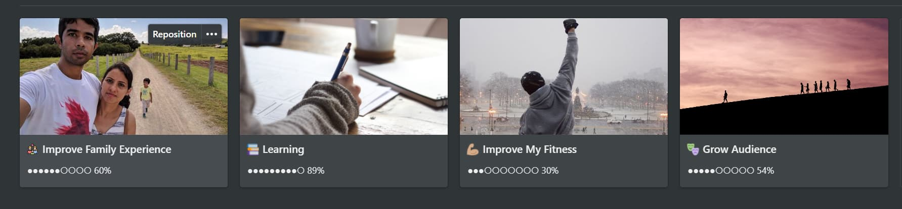
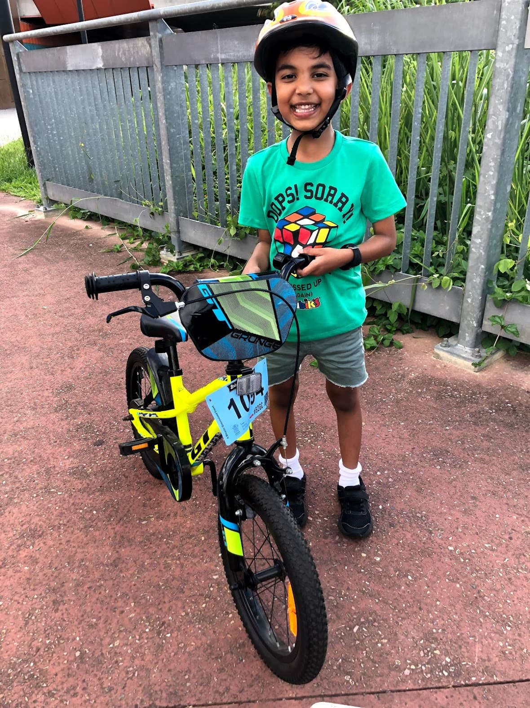
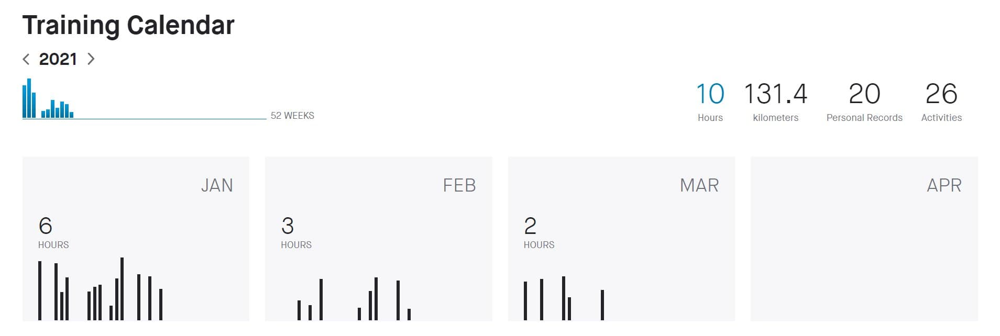
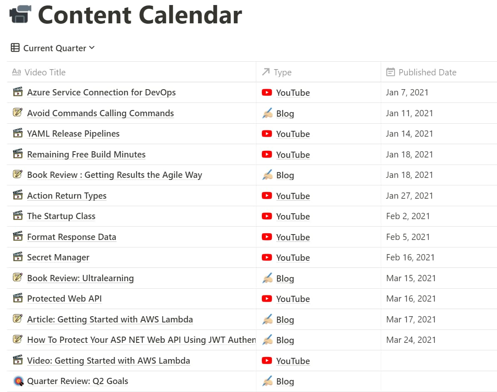
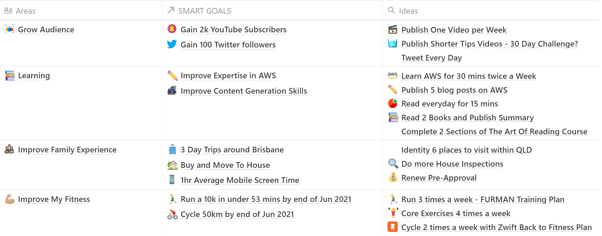

This year I started [setting Quarterly Goals](https://www.rahulpnath.com/blog/2020-recap/) and the plan was to track every quarter to keep a check on the progress. 

And looks like we are already end of March and it's time to do a review. As promised here is my first Quarterly review post.

Since this is the first time I am doing a Quarterly, OKR styled Goal tracking, it is quiet possible that I have overcommitted myself or just that it's been a lazy first quarter. 

Here is how my first quarter went, some of the learnings and plan for the upcoming quarter.

## Review of Q1, 2021

Here is a summary of how I progressed with Goals I had set myself for the [first quarter of 2021](https://www.rahulpnath.com/blog/2020-recap/#goals-for-2021). At a high level, my focus was on 4 Areas of my Life.

Each of these Areas, had associated SMART Goals set, which was mostly measurable. This enabled me to come up with a percentage progress. Even though some of these items where either a done or not done case I ended up coming up with some figures to account for my progress. 

For e.g. with *Run a HM in 2:00 by end of March 2021* even though I was not able to do this, I have used some calculations on how I am progressing (based in information from Strava/Garmin to arrive on a progress percentage). While this might not be accurate, it still gives me some thing to refer back to.

Let's take a closer look at each of the sections above and see how I did in each of these categories and some lessons learned.

### Improve Family Experience ●●●●●●○○○○ 60%

Much of the things went as planned for this Area. Except for buying a house (which we are still actively looking) I was able to make good progress on the rest.

We did lots of day trips around Brisbane (parks, golf course, beaches etc) and had a great time doing it (all of it following and safe as per the COVID guidelines in Queensland).

I am also happy to see that Gautham is able to ride the bicycle all alone which was one of the Kid Projects that I took on.

For screen time I averaged around 70-80 mins, which is slightly more than what I originally intended it to be. 

**Overall Percentage: 60%**

### Learning

By far the learning goal went very much as planned. Except for the [The Art of Reading](https://alexbooks.podia.com/the-art-of-reading) online course (c*ourse launch date got pushed to April 19th*), I was able to complete most of the things I originally set out for.

I wanted to read the book on Microservices but that didn’t happen though . I did get started on it , however I didn’t continue past the second chapter. 

However I have been reading up on AWS for my new job at OFX. I am working on setting up a Learning path for AWS using some ideas from [Ultralearning](https://www.rahulpnath.com/blog/ultralearning-book-summary/). (*Of course, I'll publish it here on my blog once I have a rough plan*)

**Overall Percentage:** 

### Improve My Fitness

The one Area that I lacked the most is improving my fitness. Ever since I dislocated my shoulder early last year (New Years day 2020 to be precise), I have been slacking off on my running and cycling. 

I have been on and off running and a bit of cycling with little or no core exercises. With the start of the new year, I intended to get back to it and build back my old routine. 

Event though I intended to do on an average of 5 activities per week (3 runs and 2 cycle), I ended up roughly doing 2 per week.

While I could blame the weather, other priorities etc., truth to be told I was a bit lazy. Even on the days I went out running I found myself running slower and shorter distances. 

I was on and off with the Core workout exercises as well and never got on a regular schedule with it. 

**Overall Percentage: 30%**

### Grow Audience

Main focus for growing my audience has been with YouTube and it has been just ok.  I had a goal of growing 2500 subscribers while I only  around half way there with the goal at 1200 (TDK). 

I did not do anything different other than usual content generation. I gave up on YouTube Shorts right after the first one (as I did not like the video format) also never got to do any YouTube Live.

Same with growing a Twitter followers, I wanted to add 200 followers, but only at around 54 now.

Part of this might also be because, I have set  a very high goal to start with. 

Below is a snapshot of my Content Calendar for the last quarter. I published **6 blog posts** and **9 YouTube videos**. 

I have been mostly consistent with the content schedule of 1 video per week and 2 blog posts per month, except for a few missed out weeks between Feb and March. 

This was mostly because I was stuck and procrastinating with the JWT Authentication in ASP NET Core (TDK LINK) video. 

I didn't do anything on 'Pre-Launch Online Course' and I have decided to discard that goal (right after first few weeks). I also ignored it from the overall percentage score.

**Overall Percentage:** 

## Goals for Q2, 2021

Taking on some  **learnings from the last quarter**

- Overcommitted on the YouTube and Twitters growth count.
- Did not try new methods to grow Audience
- Ideas were not tracked or monitored closely
- Fitness Goals felt unreachable (were set based on my fitness levels over an year back)

My high-level Areas of focus remains the same - **Fitness, Grow my Audience, Learning and Improving Family Experience.**

But I have adjusted some of the SMART Goals and targets based on the past quarter learnings. 

I have also added tracking for the Ideas to see how I progress on each of them 

> *Check out my* [**December Newsletter**](https://rahulpnath.substack.com/p/december-newsletter) *if you want to learn more about Goal Setting!*

Some of my main Key Results for the second quarter of 2021 are

- Run a 10k in under 53 minutes by end of Jun 2021
- Gain 2k    YouTube Subscribers and 100 Twitter followers.
- Improve my Expertise in AWS and also improve my content generation skills.
- More family trips and Buy and Move to a House

I am aiming high here with these Goals and would be happy to hit 80% of them. I will do a follow-up review towards the end of March 2021 and see where I stand with these Objectives and Goals.

How's the year been going for you? 

*Photo by [Isaac Smith](https://unsplash.com/@isaacmsmith?utm_source=unsplash&utm_medium=referral&utm_content=creditCopyText) on [Unsplash](https://unsplash.com/@isaacmsmith?utm_source=unsplash&utm_medium=referral&utm_content=creditCopyText)*
  