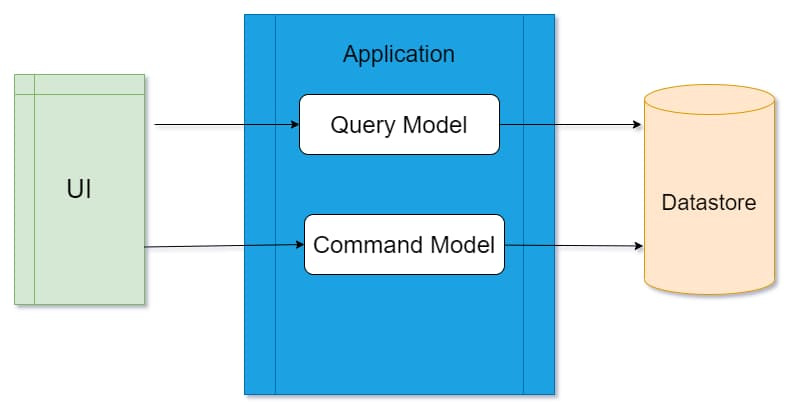

One of the patterns that I keep coming back to when building ASP NET Applications is the Command and Query Responsibility Segregation (CQRS) pattern. Fundamentally all that is there to the pattern is to separate the code to read (Query) and the write (Command) to the data store.

By separating the Commands and Queries, the code is more focused on the task performed. If you are familiar with the Create-Read-Update-Delete (CRUD) pattern, then you can think of Queries as 'R' and Commands for 'CUD'.



The [MediatR](https://github.com/jbogard/MediatR) library provides an In-process messaging solution and enables applying CQRS pattern to our application code. The library support Commands, Queries, Notifications, Events and a lot more that makes it easy to enable CQRS pattern.

Let's see an example below of a Command handler for creating a new Order in an application. The `CreateOrderCommand` is created when a new order is to be created. The `CreateOrderHandler` handles this command and creates a new Order in the database as shown below.

```csharp
public class CreateOrderHandler : IRequestHandler<CreateOrderCommand, Unit>
{
    private readonly IMediator _mediator;
    private readonly OrderContext _context;

    public CreateOrderHandler(IMediator mediator, OrderContext context)
    {
        _mediator = mediator;
        _context = context;
    }

		public async Task<Unit> Handle(
		    CreateOrderCommand request, CancellationToken cancellationToken)
    {
        var order = request.ToOrder();

        _context.Order.Add(order);
        await _context.SaveChangesAsync();

		return Unit.Value;
    }
}
```

Now let's say that when a new Order is created, we need to send a notification to Shipping department also send an Email.

The easiest way to implement this one might think is to add in two more commands - `SendShippingNotificationCommand` and `SendOrderEmailCommand` and invoke these commands from the `CreatedOrderHandler` as shown below.

```csharp
public async Task<Unit> Handle(
    CreateOrderCommand request, CancellationToken cancellationToken)
{
    var order = request.ToOrder(rep);

    _context.Order.Add(order);
    await _context.SaveChangesAsync();

    await _mediator.Send(new SendShippingNotificationCommand(order.Id));
    await _mediator.Send(new SendOrderEmailCommand(order.Id));

	return Unit.Value;
}
```

This works for the time being. As we build the application, let's say there are other code ways to create a new Order. e.g.

_Converting a Quote to an Order_  
_Manual Approval for Quotes that are above a certain price threshold etc._

Now these actions are to be modeled as different Command handlers - `QuoteToOrderHandler`, `ApproveQuotePriceHandler` etc. These handlers can easily read back the Quote object and update the necessary properties to make it an Order. These are independent piece of code and not duplication anywhere else.

But what about the side effects of creating an order? Sending a notification to Shipping and sending an email?

We have to duplicate the calls to send the respective commands in both handler above and in any more that creates a new order.

More than duplicating the code, we also now need to keep track of the things to perform any time a new Order is created. This soon becomes hard to handle and can cause a lot of issues.

Let's see how we can fix it!

## Raise Domain Events

The problem with the above code is that it is coupling the action and reaction of creating a new Order. We can easily separate this using the concept of Events - Domain Events to be more precise.

When an order is created we can publish an Event - `OrderCreatedEvent`

```csharp
public class OrderCreatedEvent: INotification
{
    public OrderCreatedEvent(int id)
    {
        Id = id;
    }

    public int Id { get; }
}
```

Instead of invoking the `SendShippingNotificationCommand` and `SendOrderEmailCommand` from the `CreateOrderHandler` , we can now publish an event whenever an Order is created. These events usually turns out to be events in the Domain itself, like in this example here; It is an Event when an Order is created.

```csharp
public async Task<Unit> Handle(
    CreateOrderCommand request, CancellationToken cancellationToken)
{
    var order = request.ToOrder(rep);

    _context.Order.Add(order);
    await _context.SaveChangesAsync();

    await _mediator.Publish(new OrderCreatedEvent(order.Id));

	  return Unit.Value;
}
```

For these Events, you can create zero or more handlers, that will be invoked any time these Events are published.

In the below example I have a single handler which then invokes the other actions that needs to be performed when an Order is created.

```csharp
public class OrderCreatedEventHandler: INotificationHandler<OrderCreatedEvent>
{
    public Task Handle(OrderCreatedEvent orderEvent, CancellationToken cancellationToken)
    {
		    await _mediator.Send(new SendShippingNotificationCommand(order.Id));
		    await _mediator.Send(new SendOrderEmailCommand(order.Id));
    }
}
```

Depending on your application use-case, this can be split into multiple handlers as well and have each handler to perform a specific action. MediatR supports different [Publish strategies](https://github.com/jbogard/MediatR/wiki#publish-strategies) that you can use.

With the code now decoupled using Events, we can raise an `OrderCreatedEvent` any time it happens and be assured that all the related actions are invoked. We no longer have to duplicate these logic in multiple commands where it is possible for Orders to be created.

So the next time you are invoking a command from another command handler, take a step back and think. Is there a Domain Event that I can extract here? Raise that event and let that drive the business process associated to that event!

Since you never say never, try and Avoid calling Commands from Commands!
