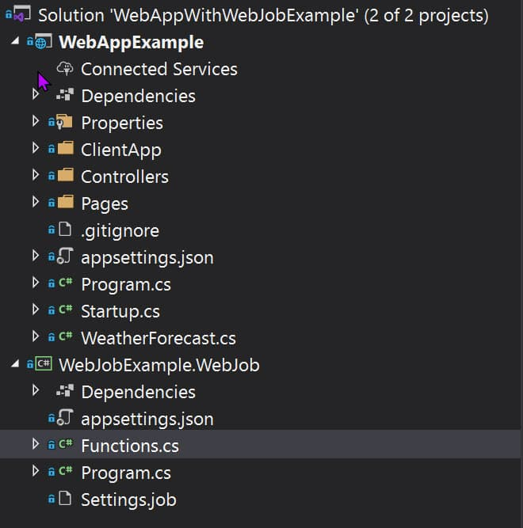
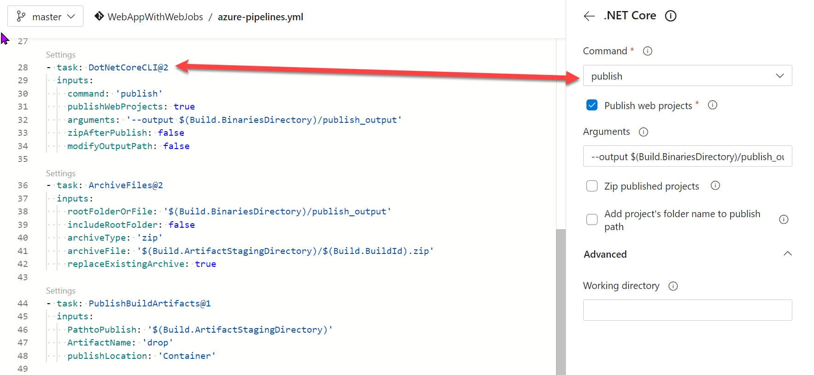
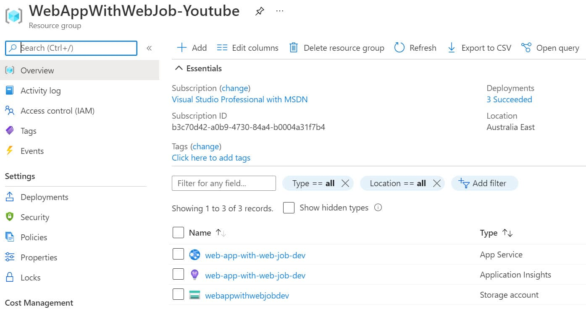
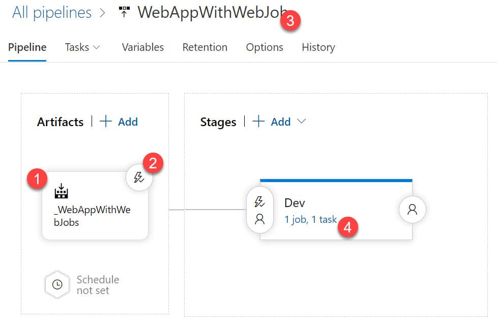
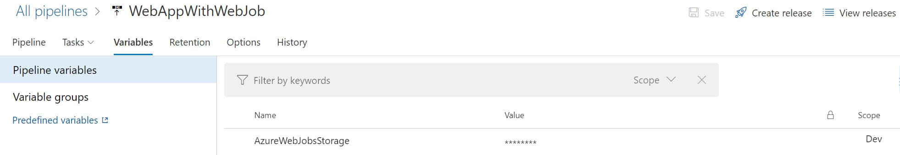
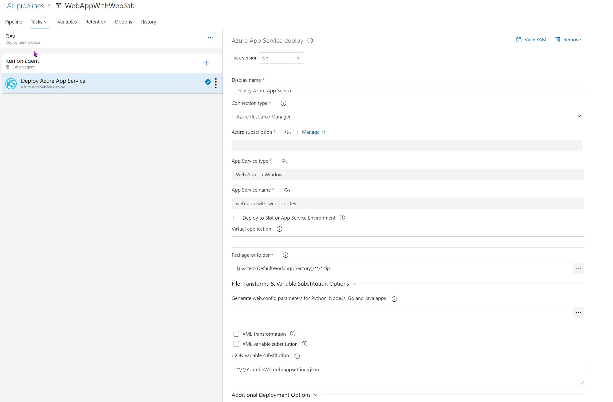

import { Bookmark } from 'components/common'

How do you deploy an Azure Web App along with a Web Job?

I keep getting this question. I had covered how to [Continuously Deploy Your .NET Core Azure WebJobs](https://www.rahulpnath.com/blog/azure-webjobs-dotnet-core-build-depoy/) in a previous post. Check that out if you are getting started with WebJobs.

This post will add to the [earlier project](https://rahulpnath.visualstudio.com/YouTube%20Samples/_git/WebJobs), an Azure Web App and show how to set up a build and deploy pipeline for both Web App and Web Job.

## Add a Web App

Let's add an ASP NET Core React Single Page Application to the WebJob project, using the Add New Project in Visual Studio.

The solution now has two projects:

- **WebApExample -** React Single Page Application
- **WebJobExample.WebJob -** Web Job Application (set up in this [post in detail](https://www.rahulpnath.com/blog/azure-webjobs-dotnet-core-build-depoy/))



Let's push this up into [Azure DevOps repository](https://rahulpnath.visualstudio.com/YouTube%20Samples/_git/WebAppWithWebJobs), where we will set up the build and deploy pipeline. 

## Setup Build Pipeline

Let's create a new Build Pipeline for this new repository. We already have an `azure-pipelines.yml` from the previous Web Jobs set up. All we need to do is add tasks to build the Web App project as well. 

The WebJob `publish` task, has a specific folder structure (*App_Data/jobs/continuous/YoutubeWebJob*) as the output folder. It is by convention, and Azure expects WebJobs to be in that folder structure in the webserver (IIS). Depending on whether the WebJob is continuous (*AppData/jobs/continuous*) or triggered (*App_Data/jobs/triggered*), the build artifacts folder changes.

The existing `publish` task uses a wildcard pattern to find the csproj file within the source repository. It was fine when it had only one project. Since now we have two project files, let's update that to be more specific to our WebJobs project file - `projects: '**/WebJobExample.WebJob.csproj'`

To publish the Web App project, we can add one more [DotNetCoreCLI task](https://docs.microsoft.com/en-us/azure/devops/pipelines/tasks/build/dotnet-core-cli?view=azure-devops) to the build pipeline (very similar to the publish task for WebJobs)



```yaml
- task: DotNetCoreCLI@2
  inputs:
    command: 'publish'
    publishWebProjects: true
    arguments: '--output $(Build.BinariesDirectory)/publish_output'
    zipAfterPublish: false
    modifyOutputPath: false
```

The entire `azure-pipelines.yml` file is [available here.](https://rahulpnath.visualstudio.com/YouTube%20Samples/_git/WebAppWithWebJobs?path=%2Fazure-pipelines.yml)

## Setup Release Pipeline

With the build artifact ready, let's release this to an Azure Web App. 

### Create Resources

To keep things simple, I'll be manually creating the resources required to deploy the application manually. However, if you are setting up for your project, I suggest setting up the resources through code. It is referred to as Infrastructure as Code (IaC). One way to implement Infrastructure as code for Azure solutions is to use Azure Resource Manager (ARM) Templates. 

ARM VIDEO

But for now, let's head off to Azure Portal and manually create the resources.

- **Azure Web App** → To deploy the Web App and Web Job
- **Storage Account** → Queue where Web Job is listening for messages.

As shown below, create the resources under a Resource Group. *A [Resource Group](https://docs.microsoft.com/en-us/azure/azure-resource-manager/management/manage-resource-groups-portal) is a container that holds related resources for an Azure solution.*



### Create Pipeline

To create a new release pipeline under Pipelines → Releases, use the '*New Release Pipeline*' option. 

It prompts you to select a template. Choose 'Azure App Service deployment', to deploy into an Azure App Service. 

The template will automatically set up one stage with the required task to deploy the Azure Web App. 



1. Under the Artifacts section, select the Build Artifact that we created in the previous step.
2. If you want the Release to be automatically triggered, use the icon on top of the Artifacts session and enable '*Continuous deployment trigger*'.
3. Give the Pipeline an appropriate name.
4. Select the Dev Stage to set up the Task

For the Dev Stage, select the Azure Web App instance created in the previous step. 

The [appsettings.json](https://rahulpnath.visualstudio.com/YouTube%20Samples/_git/WebAppWithWebJobs?path=%2FWebJobExample.WebJob%2Fappsettings.json) file under WebJob project expects the `AzureWebJobsStorage` to be populated with a valid Storage Account connection string. To view and copy the connection string, navigate to [Access keys under the storage account](https://docs.microsoft.com/en-us/azure/storage/common/storage-account-keys-manage?tabs=azure-portal#view-account-access-keys).

The Variables section in the Release Pipeline helps manage Stage (or environment) specific variables in Azure DevOps. Add a key-value pair for the Scope (stage or environment), in this case, Dev.

To replace the variable value during Release, specify the `appsettings.json` file path under the 'File Transforms & Variable Substitution Options` section for the 'Deploy Azure App Service Task'. 

When a release is created and deployed to an environment, it will replace the file with the key-value from Variables.



<Bookmark
  slug="connect-net-core-to-azure-key-vault-in-ten-minutes"
  title="Want to Manage Connection Strings More Securely?"
  description="Learn how to easily set up Azure Key Vault to manage connection string and other sensitive information for your applications."
/>

The Task by default uses Zip Deploy unless explicitly specified under the 'Additional Deployment Options' section. 

With [Zip Deploy](https://github.com/microsoft/azure-pipelines-tasks/blob/master/Tasks/AzureRmWebAppDeploymentV4/README.md#zip-deploy), it deploys the entire file contents to the wwwroot folder of the Azure App Service. It will overwrite all existing files. 



Save and Create a new release! We have successfully set up a build/release pipeline for a Web App with a Web Job. 

Navigate the Azure App Service URL, and you can see the default React Single Page Application template application running. The Web Job is also successfully running, and you can view that under the Web Jobs section under the App Service in Azure Portal. 

## Single Pipeline vs Multiple Pipeline

I often get asked whether to set up a single release pipeline or multiple pipelines to deploy a Web App and associated Web Job. 

If the Web App and Web Job are usually deployed together and depend on each other, then I suggest keeping this in the same pipeline as we have seen above. 

However, if the Web Job and the Web App are unrelated and changes are independent and need to be released independently, I suggest keeping them in different App Service. 

Instead of deploying it under the same App Service as the Web App, you can create a new App Service. For Azure Web App, the pricing is at the [Azure App Service Plan](https://docs.microsoft.com/en-us/azure/app-service/overview-hosting-plans). You can create both the App Service under the same plan to save on cost. 

Keeping it separate avoids deploying into specific folders of the App Service (in this case, web app into *wwwroot* and web jobs to the *AppData/jobs*). Any changes to the file will trigger a restart of the App Service instance. You could also consider making the Web Job an Azure Function in this case.

I hope this helps to successfully set up a build deploy pipeline for your Web App and Web Job!

**[Repository](https://rahulpnath.visualstudio.com/YouTube)**

**[Build Pipeline](https://rahulpnath.visualstudio.com/YouTube)** 

**[Release Pipeline](https://rahulpnath.visualstudio.com/YouTube)**