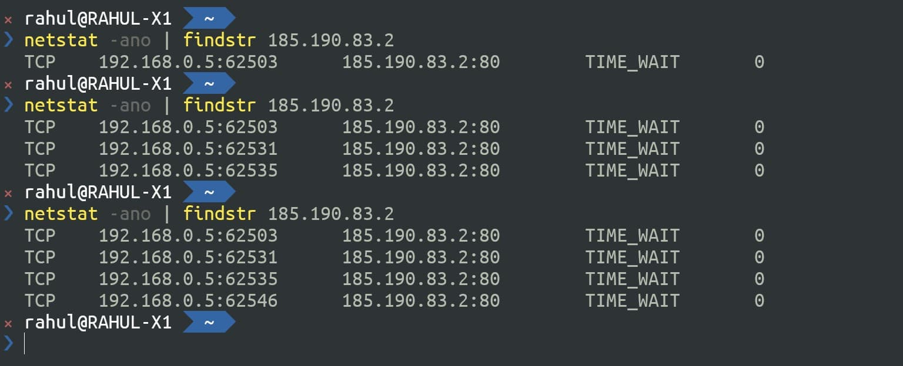

When an ASP NET application needs to talk to an external service or API it needs to make an HTTP Request.

When using [ASP.NET](http://asp.NET) to build application, this is easily done using an instance of the [HttpClient](https://docs.microsoft.com/en-us/dotnet/api/system.net.http.httpclient?view=netcore-3.1&WT.mc_id=AZ-MVP-5003875) class. An HttpClient class acts as a session to send HTTP Requests. It is a collection of settings applied to all requests executed by that instance.

Using an HttpClient might seem straightforward, however there are some underlying issues that go unnoticed until when the application is under a huge load. It is also not the best time for you to figure out these issues.

So let's spend some time now and understand the proper way to use HttpClient class and how to avoid running into issues with it for your application.

## Common Issues

Before we go any further, let's first understand the common issues when using HttpClient and how to uncover them even when running on your local machine without any load.

Below I have a code sample that is used to talk to an external API, in this case a [weather api](http://www.weatherapi.com/), to fetch weather details for a given city. The code instantiates a new instance of HttpClient and makes a GET request to the external API and returns back the JSON response.

```csharp
using(var httpClient = new HttpClient())
{
	string APIURL = $"http://api.weatherapi.com/v1/current.json?key={API_KEY}&q={cityName}";
	var response =  await httpClient.GetAsync(APIURL);
	return await response.Content.ReadAsStringAsync();
}
```

It works fine, Happy days. Let's move on to the next feature!

### Socket Exhaustion

But wait, let's take a second and fire up the command line. Let's see what's happening behind the scenes with the HttpClient and with every execution of the above code.

We will use a popular command line utility, [netstat](https://docs.microsoft.com/en-us/windows-server/administration/windows-commands/netstat), to look at the network statistics. It displays all active connection and details of it. Since we want to filter it down by the connections to the Weather API, let's filter it down using the API's ip address.

Running `ping api.weather.com` returns back the ip address we want - `185.190.83.2`

Let’s use that to filter the the records returned using the netstat command - `netstat -ano | findstr 185.190.83.2`



Every time a request is made to the API endpoint it opens a new connection the the external API. As shown in the image above, you can see more network connections when running the `netstat` command after making requests to our API endpoint. Even though we are disposing the connections in our API code, it leaves the network connections in TIME_WAIT state.

_The TIME_WAIT state means that the connection has been closed on one side (ours), but we''re still waiting to see if any additional packets come in, because of a delay in the network connection._

These connection will get eventually closed after a timeout. However, as you can see if there are a lot of requests to the API, we can soon run of sockets to create (for each of the connection above) and the application will throw an exception. The worst thing is such issues rarely happen in local development or testing, unless you perform load testing on the application.

### DNS Changes Not Reflecting

Now if creating a new instance for every request is bad, the first solution that comes to our mind is Singleton Pattern.

```csharp
private static HttpClient _httpClient;

public WeatherForecastController(ILogger<WeatherForecastController> logger)
{
    _logger = logger;
    if(_httpClient == null)
        _httpClient =  new HttpClient();
}
```

We can create a new instance of HttpClient and not dispose it thought the application lifetime. In this case we reuse the HttpClient instance, and so only one connection is maintained. This works fine as long as there are no DNS or other network level changes to the connection to the external API. If that happens we will have to restart our API application to create a new HttpClient instance.

You can read more about these issues with using the HttpClient class directly in the official Microsoft documentation.

## Use IHttpClientFactory To Create HttpClient

Now that we know the issues let’s see how to fix this . The simplest way is to inject the `IHttpClient Factory` and use that to create a new HttpClient instance.

```csharp
private readonly IHttpClientFactory _httpClientFactory;
public WeatherForecastController(IHttpClientFactory httpClientFactory)
{
	 _httpClientFactory = httpClientFactory;
}

[HttpGet]
public async Task<string> Get(string cityName)
{
  var httpClient = _httpClientFactory.CreateClient();
	string APIURL = $"http://api.weatherapi.com/v1/current.json?key={API_KEY}&q={cityName}";
    ...
}
```

To enable Dependency Injection of the `IHttpClientFactory` instance we need to make sure to call `services.AddHttpClient()` method in `ConfigureServices` method of `Startup.cs`.

Using the IHttpClientFactory [has several benefits](https://docs.microsoft.com/en-us/dotnet/architecture/microservices/implement-resilient-applications/use-httpclientfactory-to-implement-resilient-http-requests#benefits-of-using-ihttpclientfactory?WT.mc_id=AZ-MVP-5003875), including managing the lifetime of the network connections. Using the factory to create the client reuses connection from a connection pool, thereby not creating too many sockets. The connection are reused and automatically disposed to avoid DNS level issues.

If you are interested to learn more on how it works internally [checkout out this link here](https://docs.microsoft.com/en-us/dotnet/architecture/microservices/implement-resilient-applications/use-httpclientfactory-to-implement-resilient-http-requests#benefits-of-using-ihttpclientfactory?WT.mc_id=AZ-MVP-5003875).

### Consumption Patterns

There are different ways we can use IHttpClientFactory in our application code.

#### [Basic Usage](https://docs.microsoft.com/en-us/aspnet/core/fundamentals/http-requests?view=aspnetcore-3.1&WT.mc_id=AZ-MVP-5003875#basic-usage)

The above usage of IHttpClientFactory is referred to as **[Basic usage](https://docs.microsoft.com/en-us/aspnet/core/fundamentals/http-requests?view=aspnetcore-3.1&WT.mc_id=AZ-MVP-5003875#basic-usage)**, by directly injecting the factory instance into the Controller or class that requires to create a HttpClient instance. This works perfectly fine.

However often when we need to make connections to external services, we also need a set of associated configuration details like URL, secret keys, special request headers etc. While you can inject the configuration setting and other details too into the controller, the container soon starts violating the Single Responsibility Principle (SRP).

#### [Named Clients](https://docs.microsoft.com/en-us/aspnet/core/fundamentals/http-requests?view=aspnetcore-3.1&WT.mc_id=AZ-MVP-5003875#named-clients)

When using Named clients, the HttpClient instance configurations can be specified while registering the service in Dependency Injection. Instead of just calling the `services.AddHttpClient()` method in `Startup.cs`, we can add a client with a name and associated configuration.

Below we have a client with name '_weather_' and it also configures the BaseAddress to use for the client.

```csharp
services.AddHttpClient("weather", c =>
{
    c.BaseAddress = new Uri("http://api.weatherapi.com/v1/current.json");
})
```

In the Contoller class, when we need to create a new client we can use the name to create the specific client.

```csharp
  var httpClient = _httpClientFactory.CreateClient("weather");
```

#### [Typed clients](https://docs.microsoft.com/en-us/aspnet/core/fundamentals/http-requests?view=aspnetcore-3.1&WT.mc_id=AZ-MVP-5003875#typed-clients)

In the above code, we still need to hardcode the 'weather' string in the Controller and manually create a HttpClient ourselves.

To avoid having to call the `CreateClient` method explicitly we can use Typed clients pattern.

In this pattern, the calls to the external API is moved into a separate class (`WeatherService`). This new class takes a dependency on the HttpClient directly.

```csharp
public interface IWeatherService
{
	Task < string > Get(string cityName);
}

public class WeatherService: IWeatherService
{
	private HttpClient _httpClient;

	public WeatherService(HttpClient httpClient)
	{
		_httpClient = httpClient;
	}

	public async Task < string > Get(string cityName)
	{
		string APIURL = $ "?key={API_KEY}&q={cityName}";
		var response = await _httpClient.GetAsync(APIURL);
		return await response.Content.ReadAsStringAsync();
	}
}
```

When adding the new class, `WeatherService` to the Dependency Injection container we can apply the relevant configuration as shown below..

```csharp
services.AddHttpClient<IWeatherService,WeatherService>(c => {
      c.BaseAddress = new Uri("http://api.weatherapi.com/v1/current.json");
})
```

The Controller class can now use the `WeatherService` and make a call to it to get back the relevant data as shown below.

```csharp
public WeatherForecastController(IWeatherService weatherService)
{
    _weatherService = weatherService;
}

[HttpGet]
public async Task<string> Get(string cityName)
{
    return await _weatherService.Get(cityName);
}
```
